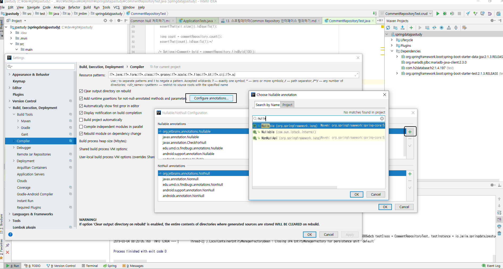
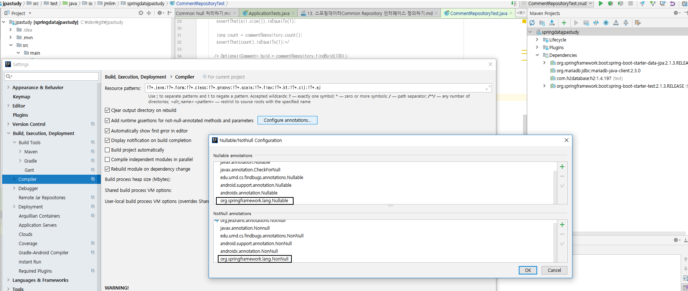

### 스프링 데이터 2.0 부터 자바 8의 Optional 지원.
 - Optional<Post> findById(Long id);
  
### 콜렉션은 Null을 리턴하지 않고, 비어있는 콜렉션을 리턴한다.

### 스프링 프레임워크 5.0부터 지원하는 Null 애노테이션 지원.
 - @NonNullApi, @NonNull, @Nullable.
 - 런타임 체크 지원 함.
 - JSR 305 애노테이션을 메타 애노테이션으로 가지고 있음. (IDE 및 빌드 출 지원)
  
### 인텔리J 설정.
 - Build, Execution, Deployment
    - Compiler
        - Add runtime assertion for notnull-annotated methods and parameters

 
 

 > 위 내용 적용하면 @NonNull 이나 @Nullable 사용하는 메소드에 null을 인자로 주입 시 표시가 됨.

```java
/**옵셔널이 제공하는 여러가지 메소드 써보기 */
/** 단일 값을 받아올땐 옵셔널을 사용하는 것을 추천한다. 아름답게 처리할 수 있다.*/
boolean present = byId.isPresent();
Comment comment = byId.orElse(new Comment());
Comment comment = byId.orElseThrow(() -> new IllegalArgumentException());
```